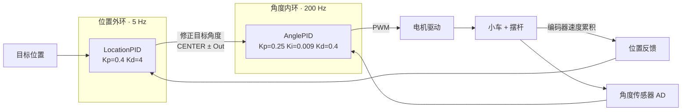

# STM32 PID 倒立摆实验

基于 STM32F10x 的 PID 控制递进实验，从电机与编码器基础驱动出发，逐步实现速度、位置、双环控制，最终完成带自动启摆的倒立摆系统。

> Progressive STM32F10x PID control experiments: from motor/encoder drivers to a self-swinging inverted pendulum with dual-loop stabilization.


## 演示视频

[](docs/media/pid-pendulum-demo.mp4)

点击封面播放 [倒立摆控制演示](docs/media/pid-pendulum-demo.mp4)（含自动启摆过程）。

---

## 实验路线

| 目录 | 内容 |
| --- | --- |
| `0-1基础驱动代码/` | 电机、编码器、PWM、按键、OLED、串口基础驱动联调 |
| `0-2位置式PID定速控制/` | 位置式 PID 闭环控制电机速度 |
| `0-3增量式PID定速控制/` | 增量式 PID 闭环控制电机速度 |
| `0-4位置式PID定位置控制/` | 位置式 PID 控制小车目标位置 |
| `0-5增量式PID定位置控制/` | 增量式 PID 控制小车目标位置 |
| `0-6位置式PID定速控制-积分限幅/` | 对积分项上下限截断，缓解积分饱和 |
| `0-7位置式PID定位置控制-积分分离/` | 大误差阶段关闭积分，小误差阶段开启积分 |
| `0-8位置式PID定位置控制-变速积分/` | 按误差大小线性缩放积分增益 |
| `0-9位置式PID定位置控制-微分先行/` | 微分项仅作用于测量值，消除目标跳变引发的微分冲击 |
| `0-10位置式PID定位置控制-不完全微分/` | 一阶低通滤波抑制微分项高频噪声 |
| `0-11位置式PID定位置控制-输出偏移-输入死区/` | 补偿静摩擦偏置并忽略微小误差 |
| `0-12双环PID定速定位置控制/` | 速度外环 + 位置内环双闭环架构 |
| `0-13双环PID定速定位置控制-代码封装/` | 将 PID 结构体与更新函数封装为独立模块 |
| `0-14基础驱动代码-角度传感器/` | 引入电阻式角度传感器，读取摆杆当前角度 |
| `0-15倒立摆/` | 角度内环 + 位置外环双环倒立摆稳摆控制 |
| `0-16倒立摆-自动启摆/` | 检测摆杆摆动相位，自动完成从垂挂到竖立的启摆过程 |

---

## 控制架构

### 双环 PID（0-15 / 0-16）

```
                     位置外环 (5 Hz)
  目标位置 ──►  LocationPID  ──► 修正角度目标值
                                        │
                     角度内环 (200 Hz)  ▼
  角度传感器 ──►  AnglePID   ──► PWM ──► 电机 ──► 小车+摆杆
       ▲                                                │
       └────────────────── 编码器 (位置积分) ───────────┘
```

内环以 5ms 周期稳定摆杆角度，外环以 50ms 周期调整目标角度设定值来控制小车位置。



### 自动启摆状态机（0-16）

摆杆从自然垂挂状态出发，无需手动推起：

```
  State 0 ── 按键 ──► State 21
                         │  施加正向 PWM
                         ▼
                      State 22 (计时)
                         │  计时到
                         ▼
                      State 23
                         │  施加反向 PWM
                         ▼
                      State 24 (计时) ─────────────────────────┐
                                                               │
  ┌── 检测到从负侧向上过顶 ── State 31～34（镜像摆动序列）──────┘
  │                                                           ▼
  └── 检测到从正侧向上过顶 ─────────────────────► State 1（观测摆动）
                                                           │
                                              摆杆进入平衡区间
                                                           │
                                                           ▼
                                                       State 4（稳摆）
                                              角度内环 + 位置外环闭环运行
```

连续两次同侧摆动的角度（Angle1 < Angle0 & Angle1 < Angle2）形成局部极小值，判断此时摆杆处于过顶后下摆最高点，触发反向助推，实现能量积累。当角度进入 `[CENTER_ANGLE ± CENTER_RANGE]` 时切入稳摆状态。

---

## 核心代码模块

| 模块 | 位置 | 作用 |
| --- | --- | --- |
| `PID_t` 结构体 | `User/PID.h` | 封装目标值、实际值、三系数、误差历史与输出限幅 |
| `PID_Update()` | `User/PID.c` | 单步位置式 PID 计算，Ki=0 时自动清零积分 |
| `TIM1_UP_IRQHandler` | `User/main.c` | 1ms 定时中断，驱动角度采样、速度积分与双环调度 |
| `Encoder.c` | `Hardware/` | 定时器编码器模式读取转速 |
| `AD.c` | `Hardware/` | ADC 采样角度传感器电压 |
| `Motor.c` + `PWM.c` | `Hardware/` | 方向控制 + 定时器 PWM 输出 |
| `OLED.c` | `Hardware/` | 实时显示两路 PID 的 Kp/Ki/Kd/Target/Actual/Out |
| `Serial.c` | `Hardware/` | 串口输出调试数据，配合上位机绘制曲线 |

**PID 核心片段（位置式）：**

```c
void PID_Update(PID_t *p) {
    p->Error1 = p->Error0;
    p->Error0 = p->Target - p->Actual;
    if (p->Ki != 0) p->ErrorInt += p->Error0;
    else             p->ErrorInt = 0;
    p->Out = p->Kp * p->Error0
           + p->Ki * p->ErrorInt
           + p->Kd * (p->Error0 - p->Error1);
    if (p->Out > p->OutMax) p->Out = p->OutMax;
    if (p->Out < p->OutMin) p->Out = p->OutMin;
}
```

---

## 调过的 PID 参数（0-16 倒立摆）

| 控制环 | Kp | Ki | Kd | 频率 |
| --- | --- | --- | --- | --- |
| 角度内环 | 0.25 | 0.009 | 0.4 | 200 Hz |
| 位置外环 | 0.4 | 0 | 4.0 | 20 Hz |

`CENTER_ANGLE = 2029`（平衡点 ADC 值），`CENTER_RANGE = 500`（保护阈值）。超出范围立即停机。

---

## 构建与烧录

1. 安装 Keil MDK 及 STM32F1 Device Family Pack。
2. 进入目标实验目录，打开 `Project.uvprojx`。
3. 确认目标芯片型号（STM32F103C8T6）、调试器与下载算法。
4. 检查电机方向与编码器接线（接反会导致正反馈失控）。
5. 首次上电前将 PWM 输出限制在较低值，手动辅助完成参数标定。

---

## 局限与说明

- 各实验为完整独立的 Keil 工程，便于学习对比，但存在较多重复文件。
- PID 参数与具体机械结构、电机参数、电源电压强相关，不能直接移植到其他平台。
- 角度传感器为电阻式，存在非线性误差，对平衡点 `CENTER_ANGLE` 的准确标定影响较大。
- 本仓库用于学习目的，运行时请为机械结构预留安全空间，首次调参建议限制 PWM 上限。
