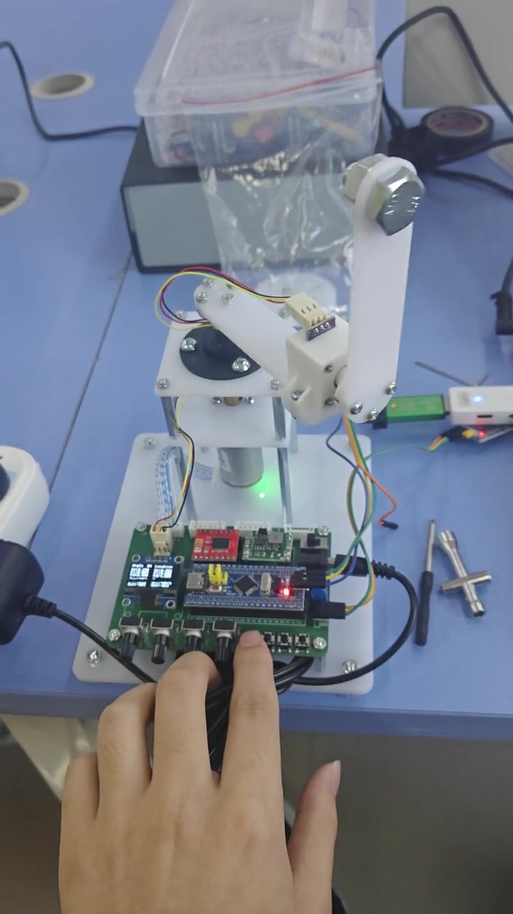
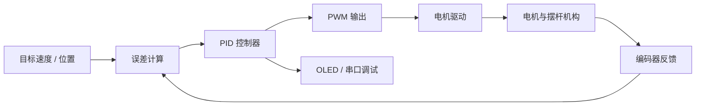

# STM32 PID Inverted Pendulum Experiments

基于 STM32F10x 的 PID 控制递进实验。仓库从电机、编码器和 PWM 基础驱动开始，依次实现位置式与增量式 PID 的定速、定位置控制，并加入积分限幅、积分分离和变速积分等改进方法。

> Progressive STM32F10x PID control experiments covering motor and encoder drivers, positional and incremental PID, integral limiting, integral separation, and variable integration.

## 演示视频

点击封面播放 [16 秒倒立摆控制演示](docs/media/pid-pendulum-demo.mp4)。公开版本已压缩为 720p H.264，并移除手机定位和设备元数据。

## 实验路线

| 目录 | 内容 |
| --- | --- |
| `0-1基础驱动代码/` | 电机、编码器、PWM、按键、OLED 和串口基础驱动 |
| `0-2位置式PID定速控制/` | 使用位置式 PID 控制电机速度 |
| `0-3增量式PID定速控制/` | 使用增量式 PID 控制电机速度 |
| `0-4位置式PID定位置控制/` | 位置式 PID 的目标位置控制 |
| `0-5增量式PID定位置控制/` | 增量式 PID 的目标位置控制 |
| `0-6位置式PID定速控制-积分限幅/` | 限制积分项，减轻积分饱和 |
| `0-7位置式PID定位置控制-积分分离/` | 大误差阶段停用积分，小误差阶段引入积分 |
| `0-8位置式PID定位置控制-变速积分/` | 根据误差大小动态调整积分累积速度 |

## 控制链路

## 主要模块

| 模块 | 作用 |
| --- | --- |
| `Hardware/Encoder.c` | 读取编码器反馈 |
| `Hardware/Motor.c` | 电机方向与输出控制 |
| `Hardware/PWM.c` | 定时器 PWM 配置 |
| `Hardware/RP.c` | 旋转电位器等输入接口 |
| `Hardware/OLED.c` | 参数和状态显示 |
| `Hardware/Serial.c` | 串口调试输出 |
| `User/main.c` | 当前实验的 PID 计算与业务逻辑 |

## 构建与运行

1. 安装 Keil MDK 和 STM32F1 Device Family Pack。
2. 进入需要验证的实验目录。
3. 使用 Keil 打开 `Project.uvprojx`。
4. 检查目标芯片、下载算法、电机方向和编码器接线。
5. 抬起或固定机械结构完成首次测试，再逐步调整 PID 参数。

## 我的实践内容

- 完成电机、编码器、PWM、OLED 和串口等基础模块联调
- 对比位置式与增量式 PID 在速度和位置控制中的行为
- 实现积分限幅、积分分离与变速积分并观察超调和稳态误差变化
- 使用独立工程保存每一步实验，便于回退和横向比较

## 当前限制

- 各实验复制完整 Keil 工程，便于学习但存在较多重复文件
- PID 参数与机械结构、电机、电源和负载相关，不能直接复用于其他平台
- 仓库尚未提供统一采样周期下的曲线、超调量和稳定时间对比
- 演示视频展示机械装置运行效果，不代表所有目录均为完整倒立摆闭环方案

## 使用说明

本仓库用于 PID 与电机控制学习。机械机构运行时应预留安全空间，并在首次调参时限制 PWM 输出。
